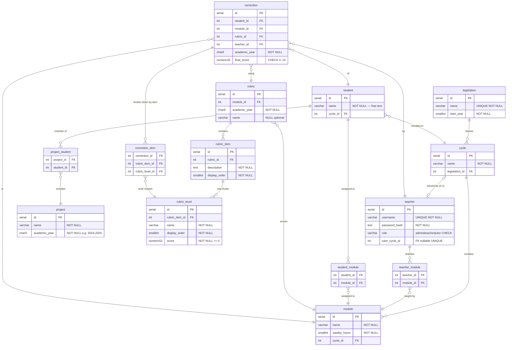

# Diagrama ERD — Corrector de Proyectos

## Notas del modelo

- **`cycle` UNIQUE(name, legislation_id)** — El mismo nombre de ciclo puede existir bajo legislaciones distintas (e.g. "DAW" en LOE y en LOMLOE son registros independientes).

- **`module` UNIQUE(name, cycle_id)** — No puede haber dos módulos con el mismo nombre dentro del mismo ciclo.

- **`teacher.role`** — `VARCHAR(10) CHECK (role IN ('admin', 'teacher', 'tutor'))`. Sin ENUM: más portable y compatible con generación de código SQL.

- **`teacher.tutor_cycle_id`** — UNIQUE + nullable. `CHECK (role = 'tutor') = (tutor_cycle_id IS NOT NULL)` garantiza que cada tutor tiene exactamente un ciclo asignado y cada ciclo tiene como máximo un tutor. Un trigger añade un mensaje de error claro en caso de violación.

- **`project` sin `cycle_id`** — El ciclo se infiere siempre a través de los alumnos miembros (`project_student → student → cycle`). No se almacena FK directa para evitar redundancia.

- **`rubric` sin `teacher_id`** — La rúbrica es un recurso del módulo, no de un profesor concreto. Cualquier profesor asignado al módulo puede usarla o modificarla.

- **`correction.teacher_id`** — Registra el profesor que realizó la corrección. Se preserva aunque el profesor cambie de asignación de módulo posteriormente (trazabilidad de autoría).

- **`rubric_level` con matriz irregular** — Los niveles se definen por ítem, no por rúbrica. Cada ítem define sus propios niveles con nombres, orden y puntuación independientes. El ítem A puede tener 3 niveles y el ítem B puede tener 5 dentro de la misma rúbrica.

- **FK compuesta en `correction_item`** — `FOREIGN KEY (rubric_item_id, rubric_level_id) REFERENCES rubric_level(rubric_item_id, id)` garantiza a nivel de BD que el nivel elegido pertenece al ítem correcto. No se necesita trigger adicional.

- **`correction.final_score`** — Calculado por la aplicación como `SUM(score de niveles elegidos) / SUM(score máximo por ítem) × 10`. No se almacena en `rubric` porque siempre es derivable.

- **`correction.academic_year` denormalizado** — Copiado de `rubric.academic_year` para permitir `UNIQUE(student_id, module_id, academic_year)` sin JOIN y facilitar consultas directas por año.

- **`project_student` con trigger** — La restricción "un alumno, un proyecto por año académico" no es expresable con una FK simple porque `academic_year` vive en `project`, no en `project_student`.

- **`teacher_module` / `student_module` sin año académico** — Asignaciones permanentes. El contexto temporal es derivable vía `module → cycle → legislation → start_year`.
