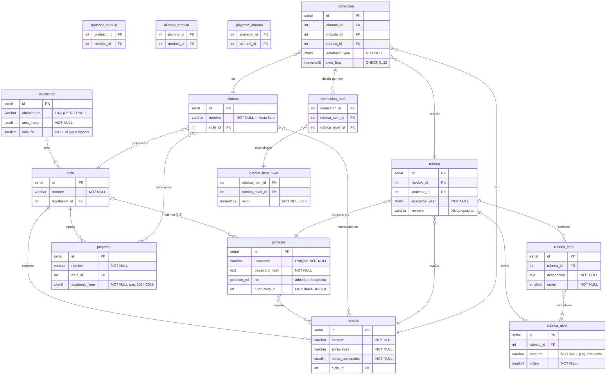

# Diagrama ERD — Corrector de Proyectos

## Notas del modelo

- **`profesor.tutor_ciclo_id`** — UNIQUE + nullable. La relación ciclo↔tutor es bidireccional
  pero se implementa como FK en `profesor`, no como tabla puente, porque la unicidad por lado
  profesor es un constraint simple. El límite de 2 tutores por ciclo se refuerza con trigger.

- **`profesor_modulo`** — asignación actual sin año académico. La historia de quién impartió
  qué módulo en cada año es derivable de `rubrica(modulo_id, profesor_id, academic_year)`.

- **`rubrica_item_nivel`** — celda de la matriz ítem×nivel. Un trigger garantiza que el ítem
  y el nivel pertenecen a la misma rúbrica (integridad cruzada no expresable con FK simples).

- **`correccion.academic_year`** — denormalizado desde `rubrica.academic_year` para permitir
  el constraint UNIQUE(alumno_id, modulo_id, academic_year) sin JOIN y para facilitar consultas
  del tipo "notas del alumno X en el curso Y".

- **`correccion.nota_final`** — calculada por la aplicación como
  `SUM(valor celdas seleccionadas) / SUM(valor máximo por ítem) × 10`. No se almacena
  `puntuacion_maxima` en `rubrica` porque es siempre derivada.

- **`proyecto_alumno`** — un alumno puede estar en un solo proyecto por año académico.
  El constraint UNIQUE(alumno_id, academic_year) no puede expresarse directamente con una FK
  (el año está en `proyecto`, no en `proyecto_alumno`), por lo que se refuerza con trigger.

- **`legislacion.anio_fin`** — nullable; NULL indica que la legislación sigue en vigor.

- **`alumno.nombre`** — texto libre. El profesor decide si introduce un nombre real o un
  código anonimizado (p. ej. `JJ499`). El sistema no impone formato.
