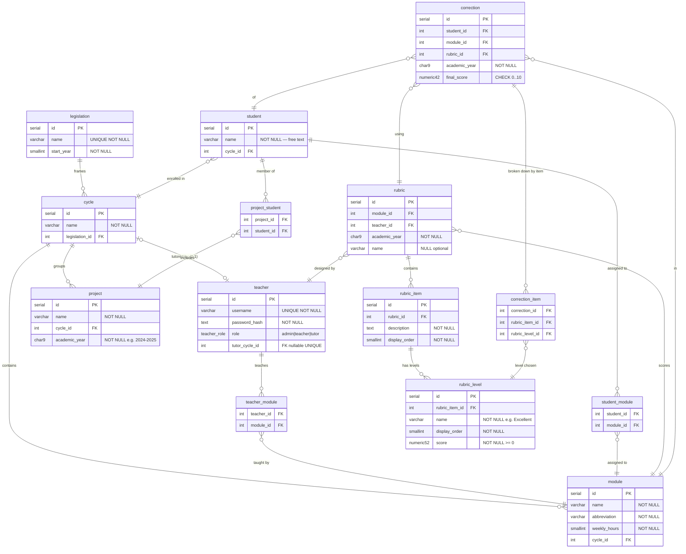

# Diagrama ERD — Corrector de Proyectos

## Model notes

- **`teacher.tutor_cycle_id`** — UNIQUE + nullable. Combined with `CHECK (role = 'tutor') = (tutor_cycle_id IS NOT NULL)`, this guarantees each cycle has at most 1 tutor and every tutor has exactly 1 assigned cycle. A trigger adds a descriptive error message on violation.

- **`rubric_level` is scoped per item (irregular matrix).** Each item defines its own set of levels with independent names, ordering and score values. There is no shared level pool per rubric. This means item A can have 3 levels and item B can have 5 within the same rubric.

- **`correction_item` composite FK** — `FOREIGN KEY (rubric_item_id, rubric_level_id) REFERENCES rubric_level(rubric_item_id, id)` enforces at the database level that the chosen level belongs to the stated item. No trigger needed.

- **`correction.final_score`** — computed by the application as `SUM(score of selected levels) / SUM(max score per item) × 10`. Not stored on `rubric` because it is always derived from `rubric_level.score`.

- **`correction.academic_year`** — denormalised from `rubric.academic_year` to support `UNIQUE(student_id, module_id, academic_year)` without a JOIN and to facilitate queries like "all grades for student X in year Y".

- **`project_student`** — one project per student per academic year enforced by trigger (`academic_year` lives on `project`, not on `project_student`, so a plain `UNIQUE` constraint cannot express this).

- **`teacher_module` / `student_module`** — permanent assignments with no academic year. The temporal context is derivable via `module → cycle → legislation → start_year`.

- **`legislation.name`** — replaces `abbreviation`; the full name (e.g. LOMLOE) is the unique identifier. `end_year` removed — derivable as `start_year + 1`.
