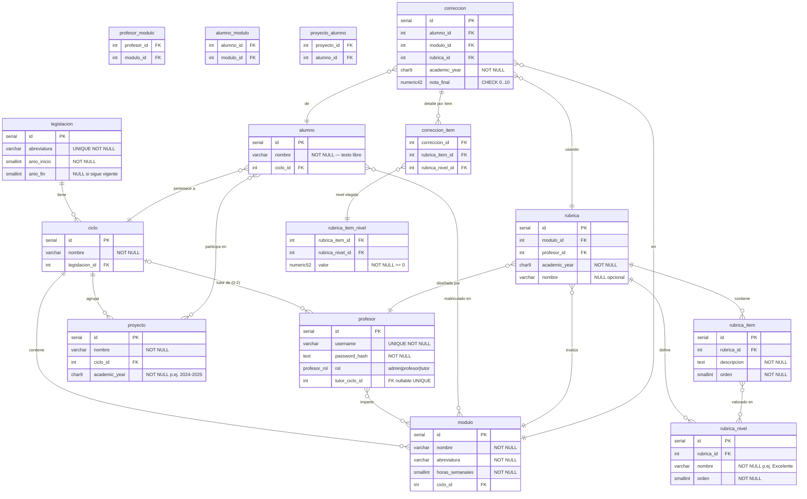

# Esquema de la base de datos

DDL PostgreSQL 16 — fuente de verdad del modelo de datos.
Lo consumen directamente el **Agente 3 — Validador de Alineación** y todos los agentes
posteriores del pipeline.

---

## Entrevista de diseño de BD

Transcripción de la sesión `/db-schema-designer` con David Betancor. Documenta todas las
decisiones tomadas, las aclaraciones y las reglas de negocio que determinan el modelo.

### Descripción inicial del cliente

> El usuario con rol profesor puede ser también tutor.
> Un usuario profesor es tutor de un Ciclo y es único. No puede haber más de 2 asociados a un Ciclo.
> El usuario profesor puede impartir varios módulos de Ciclos diferentes.
> Registro nombre de alumnos.
> Un alumno está matriculado en un Ciclo.
> Un alumno puede no estar matriculado en todos los módulos de un Ciclo.
> Los alumnos están agrupados en proyectos.
> Registro una rúbrica que corrige un módulo de un ciclo concreto que diseña un profesor.
> La rúbrica contiene ítems y niveles.
> Los niveles de una rúbrica pueden ser variables según el diseño del profesor.
> Los profesores de un ciclo corregirán a cada alumno. Cada profesor corrige su módulo.
> Y se almacena alumno y nota por módulo.

### Aclaraciones y decisiones

**Rúbrica — estructura de puntuación**

- La rúbrica es una **matriz ítem × nivel**: cada celda tiene su propio valor numérico
  independiente. No todos los ítems comparten los mismos valores por nivel.
- Flujo de corrección: el profesor **selecciona un nivel por cada ítem**; el sistema suma
  los valores de los niveles seleccionados y **pondera el resultado a 10** (normalización
  automática). `puntuacion_maxima` no se almacena — es siempre derivada.
- Se guarda el **desglose por ítem** de cada corrección para poder recalcular la nota final.

**Profesor ↔ Ciclo**

- Un ciclo puede tener **0, 1 o 2 tutores**; nunca más.
- Un profesor puede ser tutor de **como máximo un ciclo** (unicidad del lado del profesor).
- El ciclo se crea primero; el tutor se asigna al crear o editar el profesor.
- **No existe relación directa ciclo → profesor.** El vínculo es `ciclo → módulo → profesor`.

**Alumno**

- Campo único: `nombre` (texto libre). El profesor decide si introduce nombre real o código
  anonimizado (p. ej. `JJ499`). El sistema no impone formato.

**Admin**

- Rol `'admin'` es un tercer valor del ENUM `rol` en la tabla `profesor`.
  Un admin no tiene `tutor_ciclo_id` ni entradas en `profesor_modulo`.

**Alumno ↔ Proyecto ↔ Módulo**

- Un alumno pertenece a **un único proyecto por año académico**.
- La matrícula en módulos es **explícita** (gestionada por el profesor), no derivada del proyecto.

**Rúbrica y temporalidad**

- Un módulo puede tener **rúbricas distintas en años académicos diferentes**.
  Constraint: `UNIQUE(modulo_id, academic_year)` en `rubrica`.

---

## Diagrama ERD

15 tablas · 3 triggers · PostgreSQL 16



### Notas del modelo

| Decisión | Razonamiento |
|----------|-------------|
| `profesor.tutor_ciclo_id` UNIQUE nullable | Unicidad por lado profesor; límite de 2 tutores/ciclo con trigger |
| `profesor_modulo` sin año | Asignación actual; historial derivable de `rubrica(modulo_id, profesor_id, academic_year)` |
| `rubrica_item_nivel` con trigger | Integridad cruzada ítem×nivel no expresable con FK simples |
| `correccion.academic_year` denormalizado | Permite `UNIQUE(alumno_id, modulo_id, academic_year)` sin JOIN |
| `nota_final` derivada, no `puntuacion_maxima` | `SUM(celdas elegidas) / SUM(máximos por ítem) × 10` |
| `proyecto_alumno` con trigger | `UNIQUE(alumno_id, academic_year)` cruza dos tablas |
| `legislacion.anio_fin` nullable | NULL = legislación todavía en vigor |

---

## DDL — `schema.sql`

```sql
--8<-- "corrector/05-implementation/backend/schema.sql"
```
