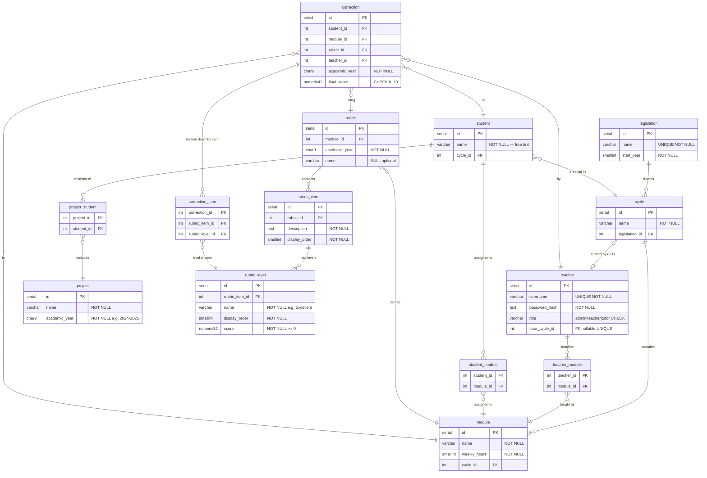

# Esquema de la base de datos

DDL PostgreSQL 16 — fuente de verdad del modelo de datos.
Lo consumen directamente el **Agente 3 — Validador de Alineación** y todos los agentes
posteriores del pipeline.

---

## Sesión de diseño de BD

Decisiones tomadas durante la sesión `/db-schema-designer`. Documentan las reglas de negocio
que determinan el modelo.

**Rúbrica — estructura de niveles**

- Los niveles son **por ítem** (matriz irregular): cada ítem define su propio conjunto de
  niveles con nombres, orden y puntuación independientes. Un ítem puede tener 3 niveles y
  otro 5 dentro de la misma rúbrica.
- El valor de cada nivel (`rubric_level.score`) vive directamente en la fila del nivel,
  eliminando la necesidad de una tabla de intersección separada.
- Flujo de corrección: el profesor **selecciona un nivel por cada ítem**; la app calcula
  `SUM(score de niveles elegidos) / SUM(score máximo por ítem) × 10`.
- Se guarda el **desglose por ítem** (`correction_item`) para permitir recálculo en cualquier
  momento sin perder la información original.

**Teacher ↔ Cycle**

- Un ciclo puede tener **0 o 1 tutor**; nunca más de uno.
- Un ciclo se crea sin tutor, pero **no puede usarse para corregir** hasta tener uno asignado
  (regla de negocio de la aplicación).
- Un teacher puede ser tutor de **como máximo un ciclo** (unicidad del lado del teacher).
- El ciclo se crea primero; el tutor se asigna al crear o editar el perfil del teacher.
- **No existe relación directa cycle → teacher.** El vínculo normal es `cycle → module → teacher`.

**Student**

- Campo único: `name` (texto libre). El teacher decide si introduce nombre real o código
  anonimizado (p. ej. `JJ499`). El sistema no impone formato.

**Admin**

- Rol `'admin'` es un valor más del campo `role VARCHAR(10) CHECK (role IN ('admin', 'teacher', 'tutor'))` en la tabla `teacher`. No se usa ENUM.
  Un admin no tiene `tutor_cycle_id` ni entradas en `teacher_module`.

**Cycle y Module — unicidad de nombres**

- El nombre de un `cycle` es único dentro de una misma `legislation`: `UNIQUE(name, legislation_id)`.
- El nombre de un `module` es único dentro de un mismo `cycle`: `UNIQUE(name, cycle_id)`.

**Student ↔ Project ↔ Module**

- Un alumno pertenece a **un único proyecto por año académico**.
- `project` **no tiene FK a `cycle`**: el ciclo se infiere siempre a través de los alumnos (`project_student → student → cycle`).
- La matrícula en módulos es **explícita y permanente** (gestionada por el teacher);
  el año queda implícito en la cadena `module → cycle → legislation → start_year`.

**Rubric y temporalidad**

- Un módulo puede tener **rúbricas distintas en años académicos diferentes**.
  Constraint: `UNIQUE(module_id, academic_year)` en `rubric`.
- La rúbrica es un **recurso del módulo, sin propietario**: no almacena `teacher_id`.

**Correction — autoría**

- `correction` registra el `teacher_id` del profesor que la realizó para mantener la
  trazabilidad de autoría incluso si el profesor cambia de asignación posteriormente.

---

## Diagrama ERD

13 tablas · 2 triggers · PostgreSQL 16



### Notas del modelo

| Decisión | Razonamiento |
|----------|--------------|
| `cycle` UNIQUE(name, legislation_id) | El mismo nombre puede existir bajo legislaciones distintas; la unicidad es dentro del marco legal |
| `module` UNIQUE(name, cycle_id) | No pueden existir dos módulos con el mismo nombre en el mismo ciclo |
| `project` sin `cycle_id` | El ciclo se infiere vía `project_student → student → cycle`; FK directa sería redundante |
| `rubric` sin `teacher_id` | La rúbrica es un recurso del módulo, no de un profesor concreto; cualquier profesor del módulo puede usarla |
| `correction.teacher_id` NOT NULL | Registra quién corrigió; se preserva aunque el profesor cambie de módulo posteriormente |
| `teacher.tutor_cycle_id` UNIQUE nullable | UNIQUE ya garantiza máx. 1 tutor/ciclo; trigger añade mensaje de error claro |
| `rubric_level` por ítem (no por rúbrica) | Matriz irregular: cada ítem define sus propios niveles y scores independientemente |
| Sin tabla intermedia `rubric_item_level` | El score vive en `rubric_level.score`; no se necesita tabla de intersección separada |
| FK compuesto en `correction_item` | `FK(rubric_item_id, rubric_level_id)` garantiza en BD que el nivel pertenece al ítem correcto |
| `teacher_module` / `student_module` sin año | Asignación permanente; el año queda implícito en la cadena `module → cycle → legislation` |
| `correction.academic_year` denormalizado | Permite `UNIQUE(student_id, module_id, academic_year)` sin JOIN |
| `final_score` siempre derivado | `SUM(scores elegidos) / SUM(score máx. por ítem) × 10`; no se almacena en `rubric` |
| `project_student` con trigger | `UNIQUE(student_id, academic_year)` cruza dos tablas; no expresable con FK simples |
| `legislation.name` único | El nombre completo (LOMLOE, LOE) es el identificador; sin `abbreviation` ni `end_year` |
| Sin ENUM para `teacher.role` | `VARCHAR(10) CHECK (role IN ('admin', 'teacher', 'tutor'))` — portable y compatible con generación de código SQL |

---

## DDL — `schema.sql`

```sql
--8<-- "corrector/05-implementation/backend/schema.sql"
```
