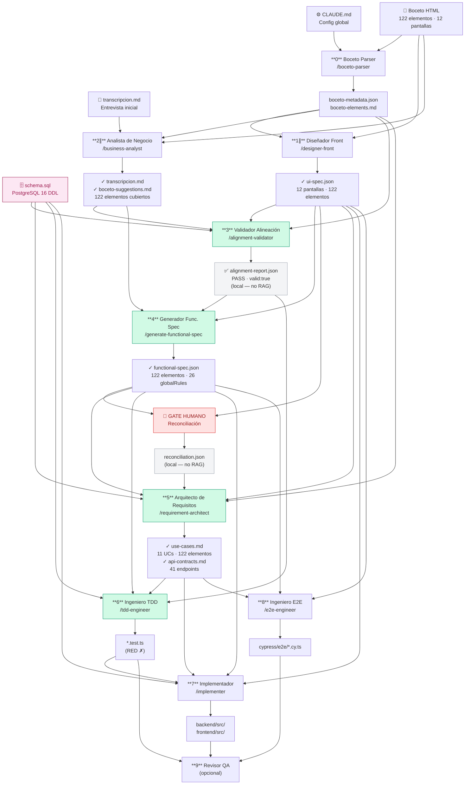

# Pipeline — Flujo de creación

Visualización del flujo completo de artefactos, desde el boceto hasta el código desplegable.

## Diagrama del pipeline

## Artefactos por fase

### Entradas humanas

| Artefacto | Ruta | Descripción |
|-----------|------|-------------|
| `CLAUDE.md` | `/CLAUDE.md` | Configuración global del proyecto y del pipeline |
| Boceto HTML | `corrector/01-boceto/html-source-prototype/` | 12 pantallas · 122 elementos con `data-element-id` |
| Entrevista inicial | `corrector/02-conversacion-cliente/transcripcion.md` | Transcripción parcial (entrada al Agente 2) |
| `schema.sql` | `corrector/05-implementation/backend/schema.sql` | DDL PostgreSQL 16 — fuente de verdad del modelo de datos |

### Fase 0 — Boceto Parse

| Artefacto | Ruta | Persistencia |
|-----------|------|-----|
| `boceto-metadata.json` | `corrector/01-boceto/` | Filesystem local |
| `boceto-elements.md` | `corrector/01-boceto/` | Filesystem local |

### Fase 1 ∥ — UI Spec

| Artefacto | Ruta | Persistencia |
|-----------|------|-----|
| `ui-spec.json` | `corrector/03-generated-artifacts/` | Filesystem local |

### Fase 2 ∥ — Interview

| Artefacto | Ruta | Persistencia |
|-----------|------|-----|
| `transcripcion.md` *(completa)* | `corrector/02-conversacion-cliente/` | Filesystem local |
| `boceto-suggestions.md` | `corrector/02-conversacion-cliente/` | ❌ Solo lectura humana |

### Fase 3 — Alignment Gate

| Artefacto | Ruta | Persistencia |
|-----------|------|-----|
| `alignment-report.json` | `corrector/03-generated-artifacts/` | Filesystem local |

### Fase 4 — Functional Spec

| Artefacto | Ruta | Persistencia |
|-----------|------|-----|
| `functional-spec.json` | `corrector/03-generated-artifacts/` | Filesystem local |

### GATE HUMANO

| Artefacto | Ruta | Persistencia |
|-----------|------|-----|
| `reconciliation.json` | `corrector/03-generated-artifacts/` | Filesystem local |

### Fase 5 — Use Cases & API

| Artefacto | Ruta | Persistencia |
|-----------|------|-----|
| `use-cases.md` | `corrector/04-use-cases/` | Filesystem local |
| `api-contracts.md` | `corrector/05-implementation/backend/` | Filesystem local |

### Fase 6 — TDD (Red)

| Artefacto | Ruta | Persistencia |
|-----------|------|-----|
| `backend/tests/*.test.ts` | `corrector/05-implementation/` | Filesystem local |
| `frontend/tests/*.test.ts` | `corrector/05-implementation/` | Filesystem local |

### Fase 7 — Implementación

| Artefacto | Ruta | Persistencia |
|-----------|------|-----|
| `backend/src/` | `corrector/05-implementation/` | Filesystem local |
| `frontend/src/` | `corrector/05-implementation/` | Filesystem local |

### Fase 8 — E2E

| Artefacto | Ruta | Persistencia |
|-----------|------|-----|
| `cypress/e2e/*.cy.ts` | `corrector/05-implementation/frontend/` | Filesystem local |

## Roles de los agentes del pipeline

| # | Agente | Slash command | Estado |
|---|--------|--------------|--------|
| 0 | Boceto Parser | `/boceto-parser` | ✅ |
| 1 ∥ | Diseñador Front | `/designer-front` | ✅ |
| 2 ∥ | Analista de Negocio | `/business-analyst` | ✅ |
| 3 | Validador de Alineación | `/alignment-validator` | ✅ |
| 4 | Generador Func. Spec | `/generate-functional-spec` | ✅ |
| — | **GATE HUMANO** | `bun cli/index.js reconcile` | Manual |
| 5 | Arquitecto de Requisitos | `/requirement-architect` | ✅ |
| 6 | Ingeniero TDD | `/tdd-engineer` | ✅ |
| 7 | Implementador | `/implementer` | ✅ |
| 8 | Ingeniero E2E | `/e2e-engineer` | ✅ |
| 9 | Revisor / QA | `/reviewer` | ✅ |
| ★ | Migration Generator | `/migration-generator` | ✅ |
| ★ | CI Setup | `/ci-setup` | ✅ |

## Gestión de tareas

Cualquier tarea, decisión de cambio o incidencia detectada durante el pipeline
se registra como un **[Issue de GitHub](https://github.com/dbetancorfp/CORRECTOR_DE_PROYECTOS/issues)**.

Casos típicos donde se abre un Issue, y quién la crea y la cierra:

| Momento del pipeline | Motivo del Issue | Crea | Cierra |
|---------------------|-----------------|------|--------|
| GATE HUMANO rechaza | Elementos huérfanos en `reconciliation.json` | Humano / comando `reconcile` | El mismo, al reconciliar con `valid: true` |
| Agente 3 falla | Inconsistencias boceto ↔ entrevista ↔ schema | Agente 3 | Agente 3, en su re-ejecución tras el fix (`valid: true`) |
| Agente 9 devuelve FAIL | Violaciones SOLID pendientes de corregir | Agente 9 | Agente 9, cuando su propio bucle de corrección llega a PASS |
| **SonarCloud Quality Gate ❌** | Bugs, vulnerabilidades, cobertura < 80 % o duplicación > 3 % | Agente 9 | Agente 9, cuando el gate vuelve a ✅ |
| Re-entrada por cambio de boceto | Nuevos elementos o pantallas a trazar | Humano (inicia la re-entrada) | Agente 3, al validar de nuevo tras la re-entrada |
| Re-entrada por cambio de schema | Migración SQL necesaria | Humano (inicia la re-entrada) | Agente 3, al validar de nuevo tras la re-entrada |

!!! tip "Regla: quien detecta, abre; quien re-verifica, cierra"
    El agente que crea la Issue es siempre el mismo que la cierra. Solo el agente que
    detectó el fallo tiene el contexto exacto de qué falló, y solo él puede confirmar
    con su propia re-ejecución que la condición está realmente resuelta — nunca un
    agente distinto, y nunca por conveniencia ("probablemente ya se arregló"). Ver
    `alignment-validator.md` (Paso 3b) y `reviewer.md` (Pasos 4c y 6c) para el detalle
    de implementación. Requiere `gh` CLI autenticado; si no está disponible, el agente
    reporta el fallo/resolución igualmente en su artefacto de salida y lo dice
    explícitamente al usuario, sin bloquear el pipeline por ello.

!!! info "SonarCloud"
    El análisis estático corre automáticamente en cada push y PR.
    El Quality Gate debe estar en ✅ antes de avanzar al Agente 8 (E2E).
    Dashboard: [sonarcloud.io/project/overview?id=dbetancorfp_CORRECTOR_DE_PROYECTOS](https://sonarcloud.io/project/overview?id=dbetancorfp_CORRECTOR_DE_PROYECTOS)

## Protocolo de re-entrada

Cuando el boceto cambia después de una iteración:

1. Abrir un **Issue de GitHub** describiendo el cambio y su motivación
2. Editar los `.html` afectados manualmente
3. `/boceto-parser` — regenera `boceto-metadata.json` + `boceto-elements.md`
4. `/designer-front` — regenera `ui-spec.json`
5. Reanudar desde el **Agente 3** (Validador de Alineación)

!!! tip "Regla de re-entrada"
    El **Agente 3** es siempre el punto de re-entrada después de cualquier cambio
    en las tres entradas originales (boceto · entrevista · schema).
