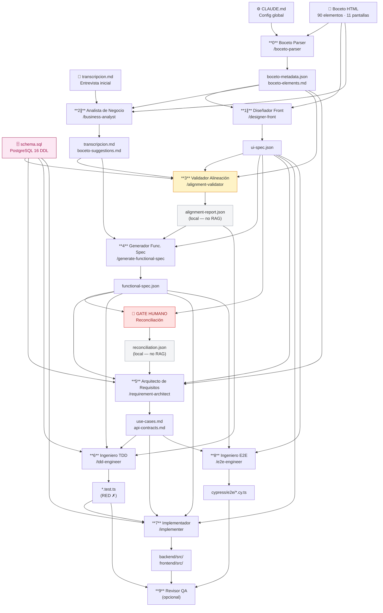

# Pipeline — Flujo de creación

Visualización del flujo completo de artefactos, desde el boceto hasta el código desplegable.

## Diagrama del pipeline

## Artefactos por fase

### Entradas humanas

| Artefacto | Ruta | Descripción |
|-----------|------|-------------|
| `CLAUDE.md` | `/CLAUDE.md` | Configuración global del proyecto y del pipeline |
| Boceto HTML | `corrector/01-boceto/html-source-prototype/` | 11 pantallas · 90 elementos con `data-element-id` |
| Entrevista inicial | `corrector/02-conversacion-cliente/transcripcion.md` | Transcripción parcial (entrada al Agente 2) |
| `schema.sql` | `corrector/05-implementation/backend/schema.sql` | DDL PostgreSQL 16 — fuente de verdad del modelo de datos |

### Fase 0 — Boceto Parse

| Artefacto | Ruta | RAG |
|-----------|------|-----|
| `boceto-metadata.json` | `corrector/01-boceto/` | ✅ phase: `boceto-parse` |
| `boceto-elements.md` | `corrector/01-boceto/` | ✅ phase: `boceto-parse` |

### Fase 1 ∥ — UI Spec

| Artefacto | Ruta | RAG |
|-----------|------|-----|
| `ui-spec.json` | `corrector/03-generated-artifacts/` | ✅ phase: `ui-spec` |

### Fase 2 ∥ — Interview

| Artefacto | Ruta | RAG |
|-----------|------|-----|
| `transcripcion.md` *(completa)* | `corrector/02-conversacion-cliente/` | ✅ phase: `interview` |
| `boceto-suggestions.md` | `corrector/02-conversacion-cliente/` | ❌ Solo lectura humana |

### Fase 3 — Alignment Gate

| Artefacto | Ruta | RAG |
|-----------|------|-----|
| `alignment-report.json` | `corrector/03-generated-artifacts/` | ❌ Solo local |

### Fase 4 — Functional Spec

| Artefacto | Ruta | RAG |
|-----------|------|-----|
| `functional-spec.json` | `corrector/03-generated-artifacts/` | ✅ phase: `func-spec` |

### GATE HUMANO

| Artefacto | Ruta | RAG |
|-----------|------|-----|
| `reconciliation.json` | `corrector/03-generated-artifacts/` | ❌ Solo local |

### Fase 5 — Use Cases & API

| Artefacto | Ruta | RAG |
|-----------|------|-----|
| `use-cases.md` | `corrector/04-use-cases/` | ✅ phase: `use-case` |
| `api-contracts.md` | `corrector/05-implementation/backend/` | ✅ phase: `use-case` |

### Fase 6 — TDD (Red)

| Artefacto | Ruta | RAG |
|-----------|------|-----|
| `backend/tests/*.test.ts` | `corrector/05-implementation/` | ✅ phase: `test-red` |
| `frontend/tests/*.test.ts` | `corrector/05-implementation/` | ✅ phase: `test-red` |

### Fase 7 — Implementación

| Artefacto | Ruta | RAG |
|-----------|------|-----|
| `backend/src/` | `corrector/05-implementation/` | ✅ phase: `code` |
| `frontend/src/` | `corrector/05-implementation/` | ✅ phase: `code` |

### Fase 8 — E2E

| Artefacto | Ruta | RAG |
|-----------|------|-----|
| `cypress/e2e/*.cy.ts` | `corrector/05-implementation/` | ✅ phase: `e2e` |

## Roles de los agentes del pipeline

| # | Agente | Slash command | Estado |
|---|--------|--------------|--------|
| 0 | Boceto Parser | `/boceto-parser` | ✅ |
| 1 ∥ | Diseñador Front | `/designer-front` | ✅ |
| 2 ∥ | Analista de Negocio | `/business-analyst` | ✅ |
| 3 | Validador de Alineación | `/alignment-validator` | ✅ |
| 4 | Generador Func. Spec | `/generate-functional-spec` | ✅ |
| — | **GATE HUMANO** | `bun cli/index.js reconcile` | Manual |
| 5 | Arquitecto de Requisitos | `/requirement-architect` | ✅ |
| 6 | Ingeniero TDD | `/tdd-engineer` | ✅ |
| 7 | Implementador | `/implementer` | ✅ |
| 8 | Ingeniero E2E | `/e2e-engineer` | ✅ |
| 9 | Revisor / QA | *(pendiente)* | ❌ |
| ★ | Migration Generator | `/migration-generator` | ✅ |
| ★ | CI Setup | `/ci-setup` | ✅ |

## Protocolo de re-entrada

Cuando el boceto cambia después de una iteración:

1. Editar los `.html` afectados manualmente
2. `/boceto-parser` — regenera `boceto-metadata.json` + `boceto-elements.md`
3. `/designer-front` — regenera `ui-spec.json`
4. Reanudar desde el **Agente 3** (Validador de Alineación)

!!! tip "Regla de re-entrada"
    El **Agente 3** es siempre el punto de re-entrada después de cualquier cambio
    en las tres entradas originales (boceto · entrevista · schema).
